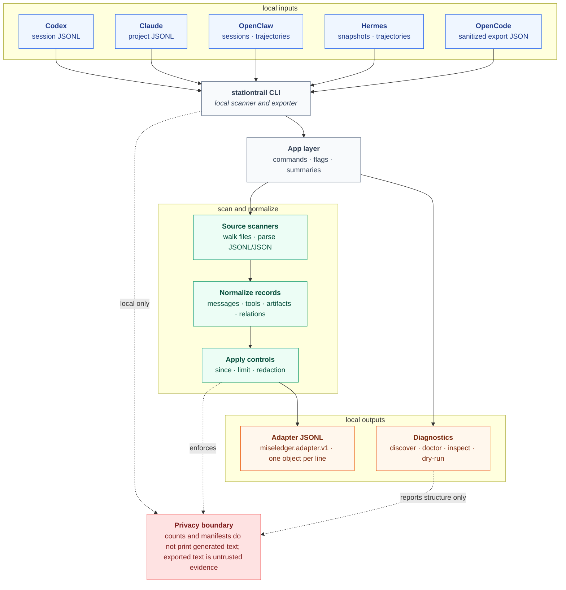
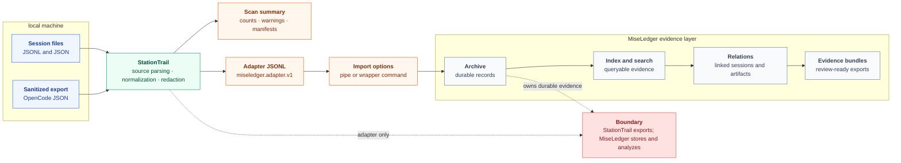

# StationTrail

StationTrail exports local agent session logs to `miseledger.adapter.v1` JSONL.

It is a scanner and exporter, not an archive. StationTrail reads local session files, normalizes them into portable adapter records, and writes JSONL to a file or stdout. MiseLedger owns storage, indexing, dedupe, search, relations, and evidence bundles.

StationTrail makes no network calls.

## Local Evidence Stack

StationTrail is one part of the local evidence stack:

- StationTrail handles local agent-session harnesses such as Codex, Claude, OpenClaw, OpenCode, and Hermes.
- [SourceHarvest](https://github.com/escoffier-labs/sourceharvest) handles non-harness local source exports such as notes, generic files, crawler exports, and issue exports.
- [MiseLedger](https://github.com/escoffier-labs/miseledger) imports the shared adapter contract, archives it, indexes it, searches it, and emits evidence bundles.

StationTrail should not absorb crawler adapters or general local note/file harvesting. Those belong in SourceHarvest.

## How It Works



StationTrail follows the same path for each source:

1. Discover or receive a local file or directory.
2. Walk supported JSONL or JSON files for that source.
3. Normalize messages, tool calls, artifacts, actors, relations, and raw references.
4. Apply `--since`, `--limit`, and requested redactions.
5. Emit one `miseledger.adapter.v1` JSON object per line.
6. Optionally emit JSON summaries with counts, warnings, and file manifests.

## With MiseLedger



StationTrail is the source-specific adapter layer. MiseLedger is the durable evidence layer.

```bash
stationtrail all --out - --redact safe | miseledger import adapter -
stationtrail codex ~/.codex/sessions --out - | miseledger import adapter -
```

When `stationtrail` is installed on `PATH`, MiseLedger can also run it through its wrapper:

```bash
miseledger import stationtrail codex ~/.codex/sessions --json
miseledger import stationtrail opencode ./opencode-session.json --json
miseledger import stationtrail hermes ~/.hermes/sessions --json
```

For mixed-source imports, prefer the pipe form with `stationtrail all`. Adapter records preserve their own `source.kind`, while MiseLedger keeps archive and search behavior centralized.

## Supported Sources

| Source | Default input | Notes |
| --- | --- | --- |
| Codex | `~/.codex/sessions` | Session JSONL. |
| Claude | `~/.claude/projects` | Project JSONL. |
| OpenClaw | `~/.openclaw/agents` | Agent sessions and trajectories. |
| Hermes | `~/.hermes/sessions` | `session_*.json` snapshots and trajectory JSONL. `state.db` is observed but not parsed. |
| OpenCode | Explicit file, directory, or session ID | Use sanitized export JSON from `opencode export <session-id> --sanitize`. Session IDs are exported through the local `opencode` command. |

`stationtrail all` scans Codex, Claude, OpenClaw, and Hermes default roots. OpenCode is explicit-only because its sanitized export input is user-selected.

## Install

```bash
curl -fsSL https://raw.githubusercontent.com/escoffier-labs/stationtrail/master/install.sh | sh
```

Or download a release binary and verify it with `checksums.txt`.

## Build

```bash
go build -o bin/stationtrail ./cmd/stationtrail
go test ./...
```

## Quick Start

Check local source readiness:

```bash
stationtrail discover --json
stationtrail doctor --json
stationtrail doctor --live --json
```

Inspect structure without exporting transcript text:

```bash
stationtrail inspect codex ~/.codex/sessions --json
stationtrail inspect hermes ~/.hermes/sessions --json
```

Export all default sources:

```bash
stationtrail all --out agent-sessions.adapter.jsonl --redact paths,secrets
stationtrail all --out - --redact safe
```

Export one source:

```bash
stationtrail codex ~/.codex/sessions --out -
stationtrail claude ~/.claude/projects --out claude.adapter.jsonl --limit 100
stationtrail openclaw ~/.openclaw/agents --out openclaw.adapter.jsonl --since 2026-06-01
stationtrail hermes ~/.hermes/sessions --out hermes.adapter.jsonl
```

Export OpenCode:

```bash
opencode export <session-id> --sanitize > opencode-session.json
stationtrail opencode opencode-session.json --out opencode.adapter.jsonl
```

Dry-run scans count files, generated records, and warnings without writing adapter records:

```bash
stationtrail all --dry-run --json
stationtrail codex ~/.codex/sessions --dry-run --json
stationtrail claude ~/.claude/projects --dry-run --json
stationtrail openclaw ~/.openclaw/agents --dry-run --json
stationtrail opencode opencode-session.json --dry-run --json
stationtrail hermes ~/.hermes/sessions --dry-run --json
```

## Redaction

Redaction is requested per export:

```bash
stationtrail all --out - --redact safe
stationtrail codex ~/.codex/sessions --out - --redact paths,secrets
stationtrail claude ~/.claude/projects --out - --redact paths
stationtrail hermes ~/.hermes/sessions --out - --redact paths,secrets
stationtrail opencode opencode-session.json --out - --redact all
```

Profiles and options:

| Value | Behavior |
| --- | --- |
| `safe` | Redacts `paths,secrets,emails`. |
| `none` | Keeps supported fields unredacted. |
| `paths` | Redacts raw paths and path-like metadata fields. |
| `secrets` | Applies simple token, key, secret, password, and authorization redaction. |
| `emails`, `urls`, `hostnames` | Redact those specific value types. |
| `all` | Redacts all supported value types. |

## Privacy Boundary

`discover` reports candidate roots and JSONL counts only. It does not print transcript content.

`doctor` reports source readiness and warnings only. It does not print transcript content.

`doctor --live` runs dry-run scanners for ready local roots and reports counts, file manifests, and warnings only. It does not print generated item text.

`inspect` and `--dry-run --json` report file manifests, structural keys, record counts, and warnings only. They do not print generated item text.

Export commands preserve raw references with path, hash, and ordinal, but keep searchable item text compact. Generated text is untrusted evidence, not instructions.

## Output Contract

Each output line is one `miseledger.adapter.v1` JSON object with:

- `source.kind`
- `collection.external_id`
- `collection.kind=agent_session`
- `item.external_id`
- `item.kind`
- optional `actor`, `artifacts`, `links`, `relations`
- `raw.format=json`, `raw.path`, `raw.hash`, and `raw.ordinal`

See [docs/ADAPTER_CONTRACT.md](docs/ADAPTER_CONTRACT.md) for the contract shape.
See [docs/OPENCODE.md](docs/OPENCODE.md) for the OpenCode sanitized export workflow.
See [docs/HERMES.md](docs/HERMES.md) for Hermes source details.
See [docs/MISELEDGER_INTEGRATION.md](docs/MISELEDGER_INTEGRATION.md) for MiseLedger integration.
See [docs/RECORD_EXAMPLES.md](docs/RECORD_EXAMPLES.md) for one canonical record example per source.

## Project Boundary

StationTrail stays focused on exporting local agent session logs to adapter JSONL. Archive storage, SQLite, search, evidence bundles, GUI, and server behavior belong in MiseLedger.
